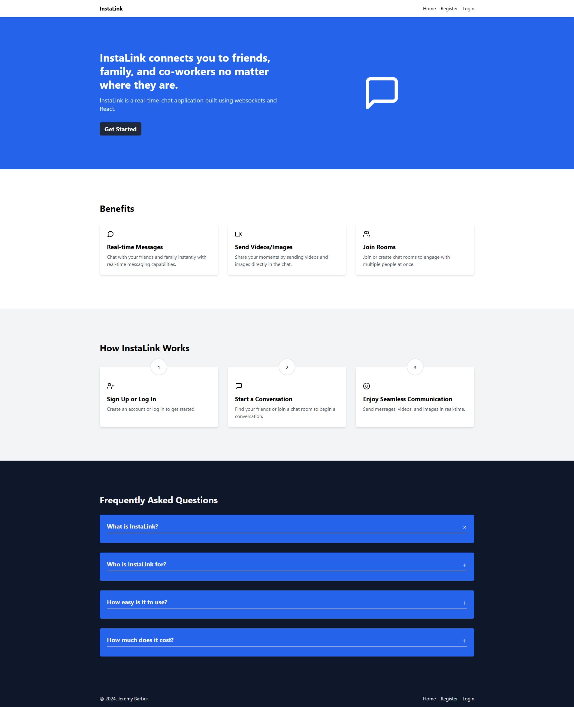

# Chat App

## Frontend Documentation
## Backend Documentation

### Introduction
This documentation covers user authentication, file management, messaging, and user profiles. The API is built using Node.js, Express, Prisma ORM, MySQL, AWS S3/Linode, and Socket.IO for real-time functionalities.

### Authentication
The backend uses JSON Web Tokens (JWT) for user authentication. Authentication routes include user registration, login, refresh tokens, and logout.

#### Endpoints

##### Register
`POST /api/v1/auth/register`

Registers a new user. Requires first name, last name, email, username, password, and password confirmation.

```json
{
  "firstName": "John",
  "lastName": "Doe",
  "email": "john.doe@example.com",
  "userName": "johndoe",
  "password": "SecurePassword123!",
  "confirmPassword": "SecurePassword123!"
}
```

##### Login
`POST /api/v1/auth/login`

Logs a user in and returns an access token and refresh token.

```json
{
  "email": "john.doe@example.com",
  "password": "SecurePassword123!"
}
```

##### Refresh Token
`GET /api/v1/auth/refresh`

Refreshes the access token using the refresh token stored in cookies.

##### Logoff
`GET /api/v1/auth/logoff`

Logs the user out and clears the refresh token from the cookies.

### File Management
Users can upload, update, retrieve, and delete files (images, audio, video).

#### Endpoints
##### Upload File
`POST /api/v1/files`

Allows authenticated users to upload files. Supported file types: image, audio, video.
(Formdata file)

##### Get File by ID
`GET /api/v1/files/:fileId`

Fetches file metadata by its ID.

##### Update File by ID
`PATCH /api/v1/files/:fileId`

Updates a previously uploaded file with a new version. Requires user authentication and ownership of the file.

##### Delete File by ID
`DELETE /api/v1/files/:fileId`

Deletes a file from AWS S3 and its metadata from the database.

### User Management
User data such as profile information, avatar, and bio can be managed via these routes.

#### Endpoints
##### Get Signed-in User Info
`GET /api/v1/users/me`

Fetches information for the authenticated user.

##### Update User Profile
`PATCH /api/v1/users/me`

Updates the user’s profile information, including bio, avatar, and password.

```json
{
  "bio": "This is my bio.",
  "avatarFileId": "some-file-id",
  "password": "OldPassword123!",
  "newPassword": "NewPassword123!"
}
```
##### Get User by ID
`GET /api/v1/users/:id`

Fetches public profile information of a specific user by their ID.

### Prisma Models
Prisma ORM is used for database interaction, with models defined for users, files, rooms, messages, and direct conversations.

### Middleware
Middleware functions are used to validate requests, authenticate users, and handle file uploads.

#### Validation Middleware
Uses zod for input validation. Ensures correct format for user inputs like email and password.

#### Authentication Middleware
Checks for JWT tokens in the request headers. If valid, attaches the user object to the request.

#### File Upload Middleware
Handles file uploads using multer and processes files (resize/compress) with sharp and ffmpeg.

#### Error Handling
Errors are managed using a custom HttpError class. Each error has a status code and message. Common errors include:

* BAD_REQUEST
* NOT_AUTHORIZED
* FORBIDDEN
* NOT_FOUND

### Socket Integration
A Socket.IO server is initialized to handle real-time chat and messaging. Full integration is still in progress.

### Environment Variables
Make sure to set the following environment variables in your .env file:

```ENV
Copy code
DATABASE_URL=...
JWT_ACCESS_SECRET=...
JWT_REFRESH_SECRET=...
PORT=...
NODE_ENV=...
S3_ENDPOINT=...
S3_BUCKET_NAME=...
S3_REGION=...
S3_ACCESS_KEY=...
S3_SECRET_KEY=...
```

### Getting Started
1. Clone the repository.
2. Install dependencies:
```bash
npm install
```
3. Set up your .env file.
4. Run database migrations:
```bash
npx prisma migrate dev
```
5. Start the server:
```bash
npm run dev
```
This will start the server on the specified port, and you can begin using the API endpoints for authentication, file management, and user interactions.